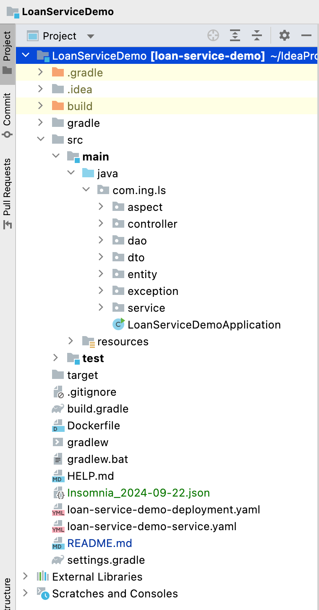
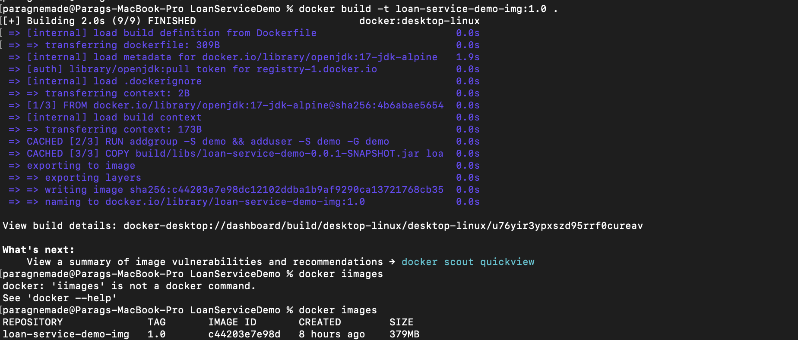
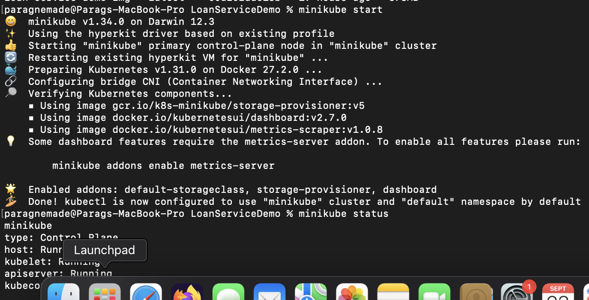
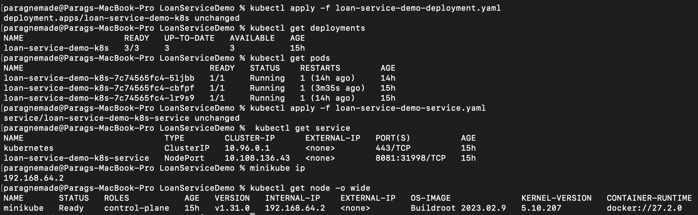
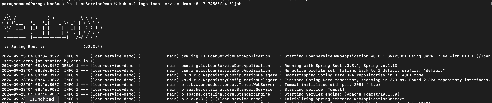
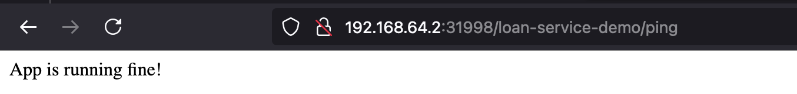
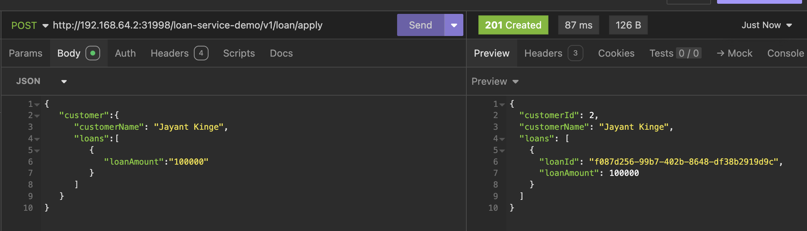
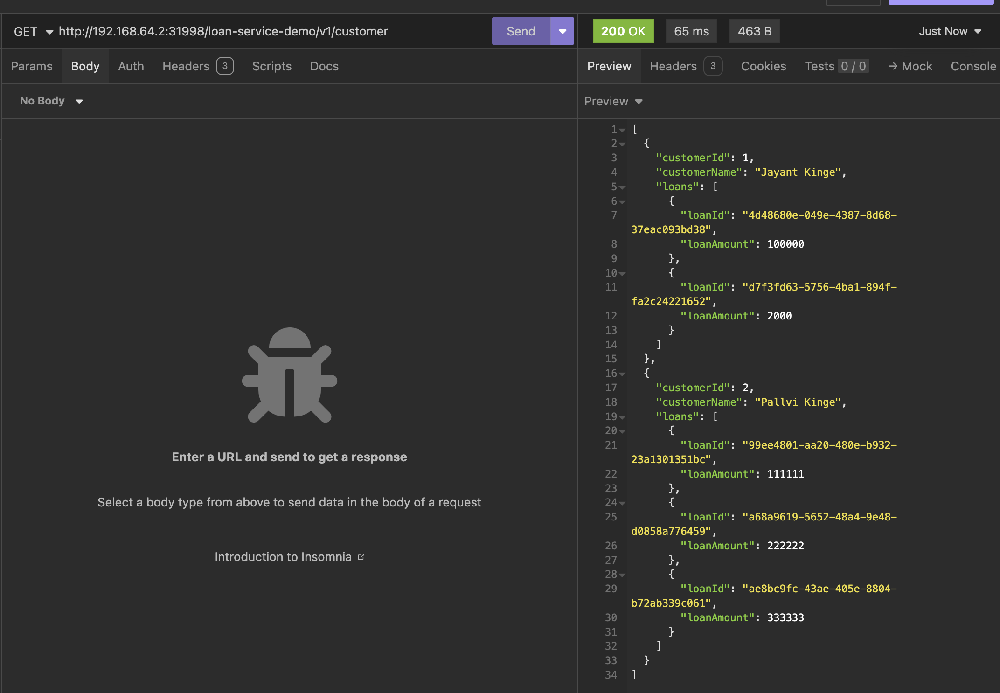
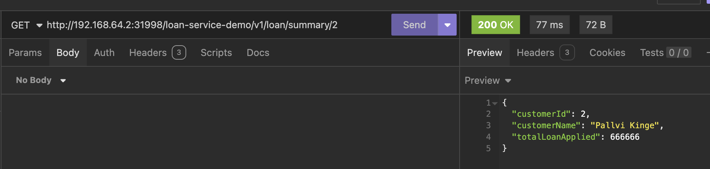

# LoanServiceDemo

- Application Base Url: http://localhost:8081/loan-service-demo/

- [Health Url](http://localhost:8081/loan-service-demo/ping)

- [Swagger Url](http://localhost:8081/loan-service-demo/swagger-ui/index.html)

- [H2 DB Consol Url](http://localhost:8081/loan-service-demo/h2-console/login.jsp)
  `url: jdbc:h2:mem:loanapp | username: admin| password: root@123`

- 
please refer below insomnia collection for accessing APIs: Insomnia_2024-09-22.json 

- Project structure:
 

- Build docker image:
 
- start minikube:
 
- deploy on loan service to k8s and see ip and ports:
 
- check logs to see if app is up
 
- Also you can check with ping url
 
- Postman/insomia request1(to apply the loan): v1/loan/apply
 
- Postman/insomia request2 (to get all customers): v1/customer
 
- Postman/insomia request3 (to get SumOfTotalAppliedLoans By any customer): v1/loan/summary/1 
  

